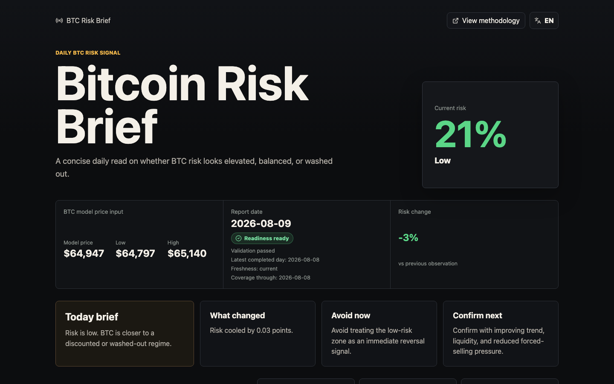
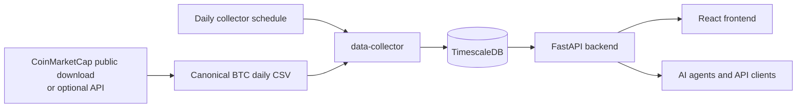

# Bitcoin Risk Brief

Bitcoin Risk Brief is a free, open-source product that turns canonical daily BTC/USD data into a transparent risk score, freshness state, and scenario price ladder. It is free permanently: no paid tier, no accounts, no SLA. The owned source code, documentation, and configuration are Apache-2.0; bundled third-party BTC/USD market data is not.

[](https://github.com/akarazhev/bitcoin-risk-brief/actions/workflows/ci.yml) [](LICENSE) [](https://bitcoinriskbrief.minihub.app/)



_First viewport captured on 2026-08-09; the values shown are a point-in-time example._

Live product: [bitcoinriskbrief.minihub.app](https://bitcoinriskbrief.minihub.app/)

Check readiness before using any current value:

```bash
curl --fail --silent --show-error https://bitcoinriskbrief.minihub.app/api/readiness
```

Response captured on 2026-08-09:

```json
{
  "status": "ready",
  "checks": {
    "risk_data_available": true,
    "validation_available": true,
    "risk_range_ok": true,
    "validation_has_rows": true,
    "latest_matches_validation_end": true,
    "source_is_canonical": true,
    "data_fresh": true
  },
  "data": {
    "latest_date": "2026-08-08",
    "covered_end": "2026-08-08",
    "data_age_days": 1,
    "max_age_days": 2,
    "source": "coinmarketcap_csv",
    "row_count": 5871,
    "methodology_version": "crypto-scout-canonical-v1.1"
  }
}
```

## What it does

- Computes a daily `0.0`–`1.0` Bitcoin risk metric from the canonical `collector/btc-csv/btc_usd_daily.csv` history.
- Shows the latest `low`, `neutral`, or `high` state alongside a two-year risk history chart.
- Displays completed-candle HLC3 model price context and a risk-level scenario ladder in `0.025` increments.
- Publishes a daily brief in English, Russian, Simplified Chinese, German, French, Spanish, and Arabic.
- Exposes read-only analytics endpoints and accepts email waitlist contacts server-side, never in browser storage; users should not submit sensitive information.

## What makes it different

- **Visible freshness and readiness.** The UI shows the latest completed day and validation state; `/api/readiness` returns HTTP 503 when freshness or validation checks fail.
- **Deterministic and reproducible.** A versioned methodology recomputes the metric from the same canonical daily history, with validation metadata recording each import.
- **Scenarios, not forecasts.** The price ladder runs hypothetical prices through the same model to show where risk levels would change; it is not a prediction or trading instruction.

## Current Status

Current operational status, evidence, and accepted limitations: [Production Readiness](docs/operations/production-readiness.md).

## For AI agents

Start with the repository [llms.txt](frontend/public/llms.txt). This branch defines the machine-readable [`/api/openapi.json`](backend/app/main.py) endpoint; deployment remains pending operator work. Use the [Agent Access Pack](docs/agents/agent-access-pack.md) for endpoint examples, cache semantics, and interpretation boundaries.

Agents must call `/api/readiness` first, bind reported values to its dates and freshness state, and preserve the analytics-not-advice framing.

## Architecture

| Service | Stack | Purpose |
| --- | --- | --- |
| `timescaledb` | TimescaleDB/PostgreSQL | BTC OHLCV, risk rows, validation state, brief snapshots, waitlist leads |
| `data-collector` | Python, asyncpg, APScheduler, httpx | Daily CSV refresh, full CSV import, risk recomputation |
| `backend` | FastAPI, asyncpg | API, readiness, waitlist storage, risk and brief reads |
| `frontend` | React, Vite, ECharts, nginx | Public seven-locale interface and API proxy |



The canonical CSV remains the durable source of truth; the collector refreshes and validates it, recomputes risk, and writes the daily snapshot consumed by the API.

## Quick Start

```bash
cp .env.example .env
./scripts/manage.sh validate
./scripts/manage.sh start
./scripts/manage.sh migrate
./scripts/manage.sh backfill
```

Open: `http://localhost:3001`

## Documentation

- [Documentation index](docs/index.md)
- [Product overview](docs/product/overview.md)
- [Risk methodology](docs/product/risk-methodology.md)
- [Architecture](docs/engineering/architecture.md)
- [API reference](docs/engineering/api-reference.md)
- [Freshness and validation](docs/engineering/freshness-and-validation.md)
- [Agent documentation](docs/agents/index.md)
- [Operations and production evidence](docs/operations/production-readiness.md)

## Disclaimer and licence

Bitcoin Risk Brief provides analytics and research context only. It is not financial advice, investment advice, a price forecast, or a trading recommendation.

Owned source code, documentation, and configuration are licensed under [Apache-2.0](LICENSE). Bundled third-party BTC/USD market data remains subject to source-provider terms; see [NOTICE](NOTICE).
